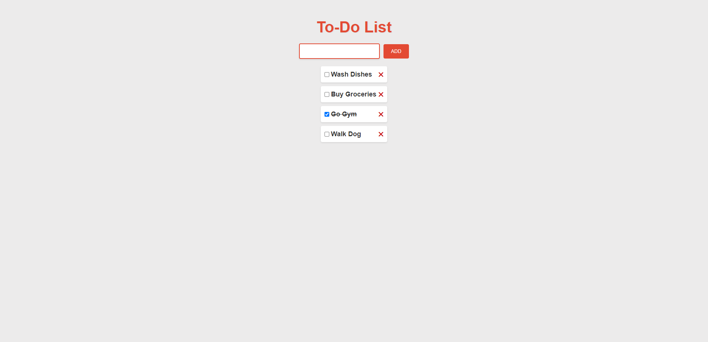

<h1 align="center">Simple To-Do List</h1>

<p align="center">
  
</p>

<p align="center">
  <a href="https://iuliangabriel.github.io/To-Do-List/" style="display:inline-block;">Live App</a>
</p>

## Overview

This project is a web-based To-Do List application that allows users to add, edit, and delete tasks. It provides a straightforward interface for managing daily tasks efficiently.

## Features

- **Add Tasks**: Easily add new tasks to the to-do list.
- **Delete Tasks**: Remove completed or unnecessary tasks.
- **Checkboxes**: Mark tasks as complete with checkboxes.
- **Local Storage**: Persistent storage to keep tasks even after page reload.

## Technologies Used

- HTML5
- CSS3
- JavaScript

 ## Installation

1. Clone the repository:

   ```bash
   git clone https://github.com/IulianGabriel/To-Do-List
